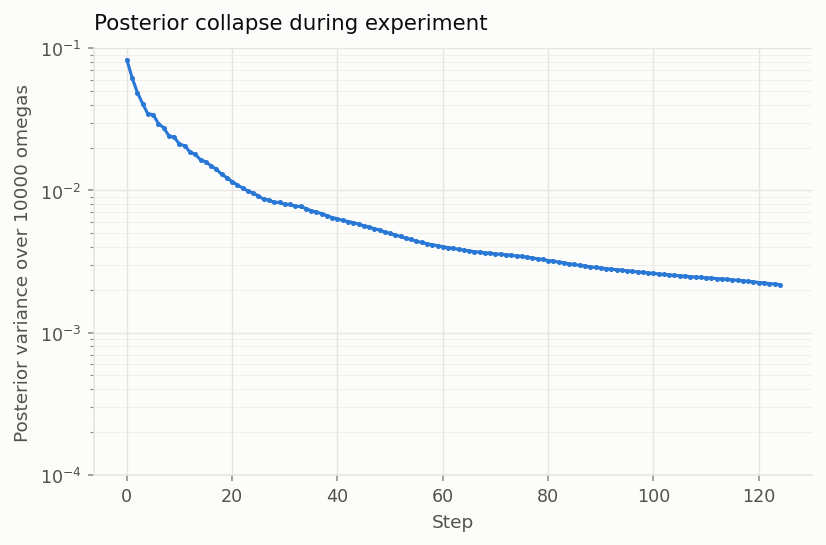
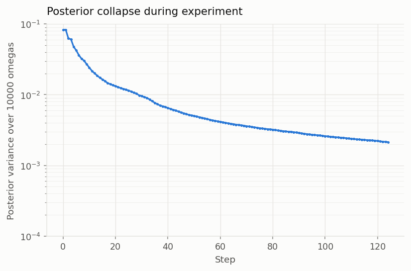
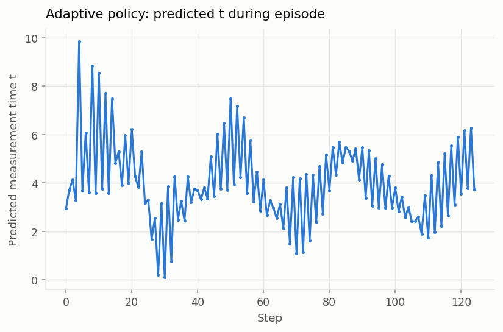
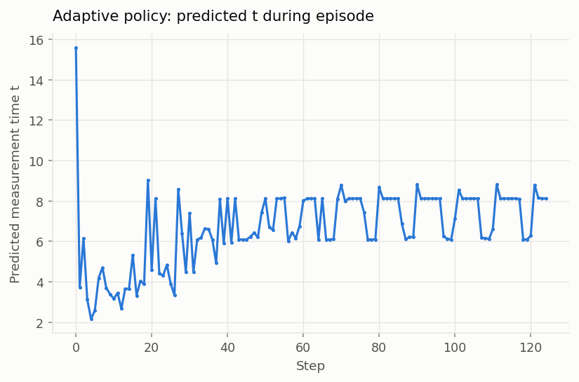
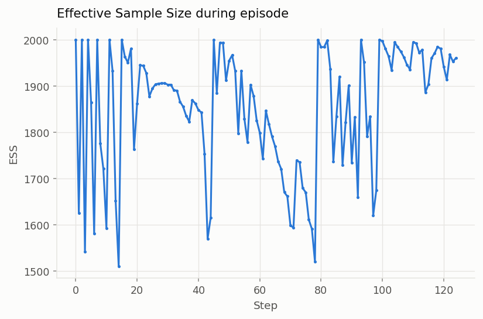
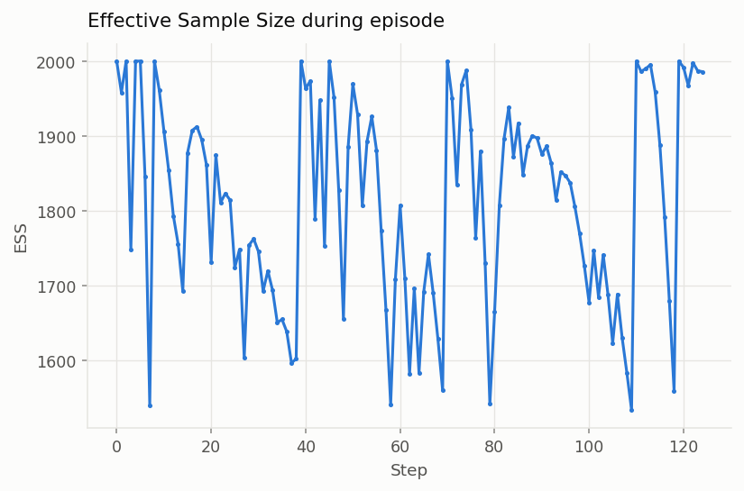

# NN-Adaptive Bayesian Quantum Estimation

Learning **when to measure** a qubit, so that you learn **what its frequency is** as
fast as physically possible.

This repository implements adaptive Bayesian experimental design for single-qubit
Ramsey frequency estimation. A sequential Monte Carlo filter maintains a posterior
over the unknown Larmor frequency $\omega$; a policy reads that posterior and picks
the interrogation time $t$ for the next shot; the measurement outcome sharpens the
posterior; repeat. The policy is trained by reinforcement learning (TRPO) or by a
gradient-free evolutionary search (CEM), following Fiderer, Schuff & Braun,
*Neural-network heuristics for adaptive Bayesian quantum estimation* — the
MLflow runs are tagged `project: fiderer`.

> **On the reference.** Equation numbers throughout this README refer to
> `fiderer.pdf` in this repository, which is the preprint (dated 2020-03-05);
> numbering may differ from the published version, PRX Quantum **2**, 020303
> (2021). The physics below has been checked against that PDF equation by
> equation. Where this implementation departs from the paper — and it does, in
> ways that matter — it is catalogued under
> [Divergences from Fiderer et al.](#divergences-from-fiderer-et-al)

---

## Table of contents

- [The physics](#the-physics)
- [The inference layer](#the-inference-layer-smc-particle-filter)
- [The control problem](#the-control-problem)
- [Methods implemented](#methods-implemented)
- [Repository layout](#repository-layout)
- [Installation](#installation)
- [Running things](#running-things)
  - [TRPO, end to end](#trpo-end-to-end)
  - [CEM, end to end](#cem-end-to-end)
  - [Baselines (no training)](#baselines-no-training)
- [Experiment tracking](#experiment-tracking)
- [Baseline results](#baseline-results)
- [Validation over 10 000 omega](#validation-over-10-000-omega-the-n-scripts)
- [Divergences from Fiderer et al.](#divergences-from-fiderer-et-al)
- [Known issues and gotchas](#known-issues-and-gotchas)

---

## The physics

### The experiment

A single qubit undergoing **Ramsey interferometry** in the presence of pure
dephasing:

1. Prepare $|+\rangle = (|0\rangle + |1\rangle)/\sqrt{2}$.
2. Let it precess freely under $H = \tfrac{\omega}{2}\sigma_z$ for a time $t$.
   This is the **control variable** — the one thing the experimenter chooses.
3. Apply a $\pi/2$ read-out pulse and measure in the computational basis.
4. Record the binary outcome $d \in \{0, 1\}$.

The qubit is not isolated: transverse noise destroys the coherence
$\rho_{01}(t) = \rho_{01}(0)\,e^{-t/T_2}e^{-i\omega t}$ on a timescale $T_2$.

### The likelihood

Solving the Lindblad pure-dephasing master equation and applying the Born rule
gives the outcome probability implemented in `modules/simulation.py:13-16`
(NumPy) and `modules/simulation.py:51-53` (Torch):

$$
P(d=0 \mid \omega, t) \;=\; e^{-t/T_2}\cos^2\!\left(\frac{\omega t}{2}\right) \;+\; \frac{1 - e^{-t/T_2}}{2}
\;\equiv\; \frac{1}{2}\Bigl[\,1 + e^{-t/T_2}\cos(\omega t)\,\Bigr]
$$

and $P(d=1) = 1 - P(d=0)$. The two forms are algebraically identical.

Read it as a **decaying interference fringe**:

| term | meaning |
|---|---|
| $\cos^2(\omega t/2)$ | the Ramsey fringe — this is what carries information about $\omega$ |
| $v(t) = e^{-t/T_2}$ | the **visibility**, or coherent fraction |
| $(1-v)/2$ | the fully dephased fraction, which returns a coin flip and tells you nothing |

As $t \to \infty$ the visibility vanishes, $P(d=0) \to 1/2$, and the measurement
becomes pure noise. **Decoherence therefore imposes a hard ceiling on how long
it is worth interrogating.**

Both the simulator and the filter's likelihood use this same expression, and
$T_2$ is treated as exactly known. The model is well-specified: there is no
model mismatch and no nuisance parameter.

### What is being estimated

| quantity | value | where |
|---|---|---|
| parameter | $\omega$, a single scalar (the Larmor frequency / detuning) | `seq_montecarlo.py:9` |
| prior | $\omega \sim \mathrm{Uniform}(0, 1)$, so $\mathrm{Var}[\omega] = 1/12 \approx 0.0833$ | `seq_montecarlo.py:9`, `:127` |
| true values | drawn from the same $\mathrm{Uniform}(0,1)$ | `train_TRPO_baseline.py:67` |
| coherence time | $T_2 = 10$ | `modules/simulation.py:31` (see [gotchas](#1-fixed_t2-is-defined-twice)) |
| control | $t \in [0.1,\ 3000]$ | `train_TRPO_baseline.py:54-55` |

Units are arbitrary — $\omega$ and $t$ only ever appear as the product $\omega t$,
and $T_2$ shares the units of $t$. With $\omega \lesssim 1$ and $T_2 = 10$, roughly
$\omega T_2 \lesssim 10$ radians of phase accumulate before coherence is lost, so a
few fringes are resolvable within the coherence window.

### The figure of merit: Bayes risk

This is a **Bayesian** estimation problem, and the quantity everything is judged
by is the **Bayes risk** — Fiderer Eq. (1):

$$
r\bigl(h \mid p(\theta)\bigr) \;=\; \mathbb{E}_{D_k}\Bigl[\,\mathrm{tr}\,\mathrm{Cov}(\theta \mid D_k)\,\Bigr]
$$

where $h$ is the experiment-design heuristic, $D_k = (d_1,\dots,d_k)$ the
measurement record, and smaller is better. It is the risk of the quadratic loss
$L(\hat\theta_k, \theta) = \lVert\hat\theta_k - \theta\rVert_2^2$ under the Bayes
estimator $\hat\theta_k(D_k) = \mathbb{E}[\theta \mid D_k]$ — that is, the
posterior mean, which is exactly what this code reports as `posterior_mean`.

For the single-parameter, experiment-limited case implemented here, the trace is
over a $1\times1$ covariance and the expectation is estimated by averaging over
true $\omega$ values. **So the Bayes risk is precisely the mean final posterior
variance** that `pipeline/evaluate.py` prints as `final_variance_mean` and that
the [Baseline results](#baseline-results) table ranks methods by. They are the
same number; the paper's name for it is the Bayes risk.

Note the framing: the paper is explicit that the *frequentist* route to
experiment design goes "with the Cramér–Rao bound formalism by maximizing the
quantum Fisher information", and it deliberately takes the Bayesian route
instead. Fisher information is a useful sanity check here
([below](#aside-why-long-interrogation-times-stop-helping)) but it is **not** the
objective.

### The reward

The reward is the **reduction in traced posterior covariance** at each step —
Fiderer Eq. (2), implemented at `modules/rewards.py:11-12` and inlined at
`train_TRPO_baseline.py:300,317`:

$$
R(D_k) \;=\; \mathrm{tr}\,\mathrm{Cov}(\theta \mid D_{k-1}) \;-\; \mathrm{tr}\,\mathrm{Cov}(\theta \mid D_k)
\;\;\xrightarrow{\;d=1\;}\;\; V_{k-1} - V_k
$$

with $V_k = \sum_i w_i(\omega_i - \bar\omega)^2$. This is not an arbitrary
choice, and it is **not** a weaker substitute for an information-gain reward.
The paper's reasoning: the negative Bayes risk is the obvious reward but is far
too slow to compute inside a training loop, whereas Eq. (2) is cheap in the SMC
framework *and* telescopes to it. Eq. (3), for $N$ experiments per episode:

$$
\mathbb{E}_{D_N}\Bigl[\textstyle\sum_{j=1}^{N} R(D_j)\Bigr] \;=\; \mathrm{const} \;-\; r\bigl(h \mid p(\theta)\bigr),
\qquad \mathrm{const} = \mathrm{tr}\,\mathrm{Cov}(\theta)
$$

So maximising the episode return **provably minimises the Bayes risk** — but the
identity holds only for an *undiscounted* return. The paper states this
explicitly: "RL has the goal to maximize the expected discounted reward which
equals the left-hand side of Eq. (3) **because we set the discount factor to
one**." This repo sets $\gamma = 0.99$, which breaks it — see
[gotcha 4](#4-gamma--099-breaks-the-bayes-risk-identity).

### Aside: why long interrogation times stop helping

Not part of the paper's framework — included because it explains the shape of
the results. Differentiating the likelihood gives the single-shot Fisher
information (`modules/policies.py:fisher_information`):

$$
I(\omega; t) \;=\; \frac{(\partial_\omega p_0)^2}{p_0(1-p_0)} \;=\; \frac{t^2\,v^2\sin^2(\omega t)}{1 - v^2\cos^2(\omega t)},
\qquad v = e^{-t/T_2}
$$

Without decoherence ($v \to 1$) this is just $I = t^2$: information grows
quadratically in interrogation time, which is why longer is better and why
adaptive schemes that grow $t$ pay off. With finite $T_2$ the envelope
$t^2 e^{-2t/T_2}$ peaks at $t = T_2$, so information per shot is **bounded** at
$I_{\max} \approx 0.135\,T_2^2$. Numerically, for $T_2 = 10$ the optimum sits at
$t^\star \approx 8.4$–$9.5$ depending on $\omega$ (`optimal_t_grid`).

This matches the paper's observation that "times which exceed $T_2$ tend to
yield no information, which explains why the Bayes risk saturates for the
exp-sparse heuristic."

### The competing constraint: phase ambiguity

Fisher information is a *local* quantity, and maximising it is the wrong move
while the prior is still broad. The likelihood depends on $\omega$ only through
$\cos(\omega t)$, which is periodic. Over the prior support $\Delta\omega = 1$ the
fringe wraps once $t > 2\pi \approx 6.28$: several well-separated $\omega$ then
produce the same phase, the posterior goes **multimodal**, and the filter cannot
resolve the aliases.

So a good policy must trade off:

- **small $t$** — unambiguous, but low information per shot ($I \sim t^2$);
- **$t \approx T_2$** — maximum information per shot, but aliases a broad prior;
- **$t \gg T_2$** — decohered, zero information, strictly wasted.

The resolution is to grow $t$ *as the posterior narrows*, keeping the phase
spread across the posterior at roughly one radian — exactly what the $\sigma^{-1}$
and PGH heuristics do, and what an RL policy is expected to discover.

Because those heuristics only reach large $t$ *after* the posterior has
collapsed, they never alias, which is why the paper discusses large-$t$ failure
purely in terms of decoherence. A **constant** $t = 10$, by contrast, aliases
from the very first shot — which is why it performs so badly in the
[measured results](#baseline-results) despite sitting at the Fisher optimum.
The two statements are consistent; they describe different situations.

## The inference layer: SMC particle filter

`modules/algorithms/seq_montecarlo.py`

$\omega$ is a **static** parameter — it does not evolve — so the filter only ever
reweights particles; the particle locations move solely during resampling.

**Representation.** $N$ particles $\{\omega_i\}$ with log-weights $\{\log w_i\}$.
Shapes are `(N, 1)` / `(N,)` in the NumPy path, `(B, N, 1)` / `(B, N)` in the
batched Torch path, where `B` indexes independent experiments.

**Bayes update** (`seq_montecarlo.py:97-117`). Log-domain throughout:

$$
\log w_i \;\leftarrow\; \log w_i + \log P(d \mid \omega_i, t) \;-\; \mathrm{logsumexp}(\cdot)
$$

Renormalised every step, so weights always sum to one.

**Effective sample size** (`seq_montecarlo.py:19-21`). The Kish ESS,
$\mathrm{ESS} = 1/\sum_i w_i^2 \in [1, N]$.

**Resampling** fires when $\mathrm{ESS} < 0.75N$ — an aggressive threshold (0.5N is
the usual default), so it triggers on most steps. Two schemes exist; the default
everywhere is **Liu–West kernel resampling** (`seq_montecarlo.py:32-71`, $a = 0.98$):

$$
\omega_i' \;=\; a\,\omega_{\mathrm{idx}(i)} + (1-a)\,\bar{\omega} + \varepsilon_i,
\qquad \varepsilon_i \sim \mathcal{N}(0,\, h^2\Sigma),\quad h^2 = 1 - a^2
$$

The shrinkage toward the weighted mean exactly cancels the variance added by the
jitter ($a^2\Sigma + h^2\Sigma = \Sigma$), so the posterior's first two moments are
preserved. The jitter is what prevents particle impoverishment — plain multinomial
resampling (`resample`, `seq_montecarlo.py:24-29`) would collapse all particles onto
a handful of duplicated values, since a static parameter never gets diffused by
process noise.

---

## The control problem

Framed as a Gymnasium environment, `AdaptiveSMCEnv` (`train_TRPO_baseline.py:225-343`):

| | |
|---|---|
| **observation** | `[posterior_mean, posterior_var, *last_30_interrogation_times]` → `Box(32,)` |
| **action** | interrogation time $t$ → `Box(0.1, 3000.0, (1,))` |
| **reward** | $V_{k-1} - V_k$ |
| **episode** | 100 measurements (training) / 125 (evaluation), one true $\omega$ per episode |

---

## Methods implemented

### Learned policies

| method | optimiser | network | entry point |
|---|---|---|---|
| **TRPO** | trust-region policy optimisation (`sb3_contrib`) | `MlpPolicy`, $\pi$ and $V$ both `[256, 256]` | `pipeline/train_TRPO_baseline.py` |
| **CEM** | cross-entropy method over the flat 545-dim weight vector | `TimePolicy_Fiderer_16` — one hidden layer of 16, `Tanh`, sigmoid-squashed output | `pipeline/train_CEM.py` |

The CEM network squashes its output structurally,
$t = t_{\min} + (t_{\max}-t_{\min})\,\sigma(z)$ (`models/nn.py:97`), so it can
never emit an out-of-range time. The TRPO actor is an unbounded Gaussian whose
sample is clipped in `step()` (`train_TRPO_baseline.py:298`).

### Training-free baselines

`modules/policies.py` — these exist so the learned policies can be measured
against something. All share one batched interface and run through **identical**
SMC and measurement code via `modules/rollout_generic.py`, which is the only way a
comparison means anything.

| policy | rule | why it's here |
|---|---|---|
| `PGHPolicy` | $t = 1/\lvert\omega_1 - \omega_2\rvert$, two particles drawn from the posterior | the standard baseline in this literature (Wiebe & Granade); keeps phase spread $\approx 1$ rad |
| `PGHPolicy(t_cap=T2)` | as above, capped at the coherence time | the standard fix for the decoherence-limited case |
| `SigmaInversePolicy` | $t = k/\sigma$ | deterministic cousin of PGH, no sampling jitter |
| `FixedTPolicy` | constant $t$ | non-adaptive control — separates "adaptivity helps" from "a good $t$ helps" |
| `ExponentialSweepPolicy` | $t_k = t_0 r^k$ | open-loop ladder; depends on step index, not on data |
| `RandomTPolicy` | $t \sim U(0.1, 3000)$ | the do-nothing floor |

---

## Repository layout

```
modules/
  simulation.py            measurement model (Born rule + T2 decay), NumPy and Torch
  rewards.py               posterior variance and variance-reduction reward
  algorithms/
    seq_montecarlo.py      SMC filter: init, Bayes update, ESS, Liu-West resampling
    CEM.py                 cross-entropy method optimiser
  rollout.py               episode rollout for a raw torch policy      -> used by CEM
  rollout_sb3.py           episode rollout for an SB3 model, CPU       -> used by test_TRPO_N
  rollout_sb3_cuda.py      batched rollout for an SB3 model, GPU       -> used by test_TRPO_N_cuda
  rollout_generic.py       batched rollout for ANY policy              -> used by evaluate
  policies.py              baseline policy zoo + Fisher-information reference

models/nn.py               policy networks (TimePolicy_Fiderer_16 is the live one)

pipeline/
  evaluate.py              evaluate ANY policy, write plots + summary   <- start here
  train_TRPO_baseline.py   TRPO training (defines AdaptiveSMCEnv)
  train_CEM.py             CEM training
  test_TRPO_N.py           evaluate a TRPO policy over N true omegas, CPU
  test_TRPO_N_cuda.py      same, batched on GPU
  test_CEM.py              evaluate a CEM policy, single omega
  test_CEM_N.py            evaluate a CEM policy over N true omegas
                           (the four test_*.py are legacy; see below)

utils/
  plotstyle.py             shared matplotlib style: palette, marks, log axes
  git_utils/git.py         commit / branch / dirty-flag provenance for MLflow
  cov.py, network_fill.py  unused

artifacts/     scratch output dir, shared across ALL runs (see gotcha 6)
mlruns/        MLflow artifact root
mlflow.db      MLflow sqlite backend (~320 MB, gitignored)
```

Note there are **four** independent copies of the SMC episode loop: the three
`rollout*.py` files plus a fourth inlined in `AdaptiveSMCEnv.step`. They differ in
small ways (see [gotcha 5](#5-the-four-rollout-implementations-are-not-equivalent)).

---

## Installation

```bash
conda create -n NNBQE python=3.11 -y
conda activate NNBQE
pip install -r requirements.txt

# CUDA build of torch, if you have a GPU (skip on Apple Silicon)
pip install torch torchvision --extra-index-url https://download.pytorch.org/whl/cu130
```

Verified working set: Python 3.11.14, torch 2.9.1, stable-baselines3 2.7.1,
sb3-contrib 2.7.1, gymnasium 1.2.3, numpy 2.3.5, mlflow 3.8.1. The saved TRPO
checkpoint was produced with exactly these versions.

A GPU is **not** required. The batched rollout does ~4.4 ms per (125-step,
2000-particle) episode on CPU, so a full 10 000-$\omega$ evaluation takes about a
minute.

---

## Running things

All commands are run as modules **from the repository root**, with the `NNBQE`
environment active.

Two entry points matter:

| | |
|---|---|
| `python -m pipeline.train_TRPO_baseline` / `train_CEM` | train a policy |
| `python -m pipeline.evaluate --policy <name>` | evaluate any policy and write plots |

`pipeline/evaluate.py` handles **every** method — both learned policies and all
six training-free baselines — through identical inference and measurement code,
which is what makes the numbers comparable. It supersedes the older
`pipeline/test_*.py` scripts ([see below](#the-legacy-pipelinetest_py-scripts)).

### Quick check that everything works

No training required — the repo ships a trained TRPO policy, and the baselines
need none. This takes a few seconds:

```bash
python -m pipeline.evaluate --policy trpo \
    --checkpoint artifacts/trpo_sb3_policy.zip --n-omegas 256
python -m pipeline.evaluate --policy pgh-capped --n-omegas 256
```

---

### TRPO, end to end

**1. Train.**

```bash
python -m pipeline.train_TRPO_baseline
```

Defaults: 10<sup>5</sup> episodes × 100 steps = 10<sup>7</sup> timesteps, 10 000
particles, `net_arch=[256,256]`, `target_kl=1e-2`. Expect **4–25 hours** on CPU
(the spread is real: the 100k-timestep run took 154 s, the 100M-timestep run
averaged 6× slower per step). Set `DEVICE=cuda` if you have a GPU.

Checkpoints are written every 50 000 timesteps, so you can evaluate a partially
trained policy at any point and a crash costs you at most one interval:

```
artifacts/checkpoints/trpo_step_<N>.zip    numbered history
artifacts/trpo_sb3_policy_latest.zip       rolling latest
artifacts/trpo_sb3_policy.zip              final, written when training completes
artifacts/checkpoints/trpo_interrupted.zip written on crash or Ctrl-C
```

Shorten a run with the environment overrides:

```bash
# ~10 minutes instead of hours
N_TRAIN_EPISODES=5000 N_PARTICLES=2000 CHECKPOINT_EVERY_STEPS=25000 \
python -m pipeline.train_TRPO_baseline
```

**2. Evaluate.**

```bash
python -m pipeline.evaluate --policy trpo \
    --checkpoint artifacts/trpo_sb3_policy_latest.zip \
    --n-omegas 10000
```

Any of these checkpoints work as `--checkpoint`:

```bash
artifacts/trpo_sb3_policy.zip                                    # best available (run caaabcb8)
artifacts/checkpoints/trpo_step_000250000.zip                    # any mid-training checkpoint
mlruns/3/809c8bf6c4cb45569dc7719cc82e24a9/artifacts/trpo_sb3_policy.zip
```

---

### CEM, end to end

**1. Train.**

```bash
python -m pipeline.train_CEM
```

Defaults: 100 generations × population 1000, elite fraction 0.1, 2000 particles,
100-step episodes, optimising the flat 545-dim weight vector of
`TimePolicy_Fiderer_16`. **About 45 minutes** on CPU (~27 s per generation).

Checkpoints every 5 generations:

```
artifacts/checkpoints/cem_gen_<N>.pt   numbered history
artifacts/cem_policy_latest.pt         rolling latest
artifacts/checkpoints/cem_final.pt     written when training completes
```

Each `.pt` holds the policy `state_dict` alongside the CEM distribution
(`mu`, `sigma`), so a run can be inspected or resumed.

```bash
# ~2 minutes instead of 45
CEM_GENERATIONS=10 CEM_POP=200 python -m pipeline.train_CEM
```

**2. Evaluate.**

```bash
python -m pipeline.evaluate --policy cem \
    --checkpoint artifacts/cem_policy_latest.pt \
    --n-omegas 10000
```

> The CEM checkpoint that ships in `mlruns/1/` is from a 2-generation run and is
> effectively untrained. Train first before drawing any conclusion about CEM.

---

### Baselines (no training)

```bash
python -m pipeline.evaluate --policy pgh                        # t = 1/|w1 - w2|
python -m pipeline.evaluate --policy pgh-capped                 # capped at T2
python -m pipeline.evaluate --policy pgh-capped --t-cap 2.0     # capped elsewhere
python -m pipeline.evaluate --policy sigma-inv --k 1.0          # t = k/sigma
python -m pipeline.evaluate --policy fixed --fixed-t 1.0        # constant t
python -m pipeline.evaluate --policy exp-sweep --t0 0.1 --r 1.05
python -m pipeline.evaluate --policy random                     # t ~ U(0.1, 3000)
```

### What evaluation produces

Output goes to `validation/run<N>/` (auto-incremented), or `--out DIR`:

| file | contents |
|---|---|
| `summary.json` | final variance mean/median/p10/p90, mean & max `t`, ESS, resample count, runtime |
| `trajectories.npz` | raw `var`, `mean`, `ess`, `t`, `omegas`, `n_resample` arrays |
| `posterior_variance_log.png` | posterior collapse, log axis — the headline plot |
| `posterior_variance.png` | same, linear axis |
| `predicted_t.png` | chosen interrogation time vs step, against the $T_2$ line |
| `ess.png` | effective sample size, against the resample threshold |
| `reward_vs_step.png` | per-measurement variance reduction |
| `final_variance_vs_omega.png` | final variance against true $\omega$ — exposes aliasing |

Useful flags: `--n-omegas` (default 2000), `--episode-len` (125),
`--n-particles` (2000), `--batch-size` (512), `--seed` (42), `--device`,
`--out`. Run `python -m pipeline.evaluate --help` for the full list.

Cost is roughly 4.4 ms per episode, so 10 000 $\omega$ takes about a minute on CPU.

### Comparing methods

Give each run its own directory and read the summaries side by side:

```bash
for m in trpo pgh pgh-capped sigma-inv random; do
    extra=""
    [ "$m" = trpo ] && extra="--checkpoint artifacts/trpo_sb3_policy.zip"
    python -m pipeline.evaluate --policy "$m" $extra \
        --n-omegas 4096 --out "validation/cmp_$m"
done

python - <<'EOF'
import json, glob
rows = [json.load(open(f)) for f in sorted(glob.glob("validation/cmp_*/summary.json"))]
print(f"{'method':<32}{'final var':>12}{'median t':>10}")
for r in sorted(rows, key=lambda r: r["final_variance_mean"]):
    print(f"{r['label']:<32}{r['final_variance_mean']:>12.3e}{r['median_t']:>10.2f}")
EOF
```

### Plot styling

All figures use `utils/plotstyle.py` — one validated categorical palette, thin
lines, small point marks, and a recessive grid. Import `apply_style()` before
creating figures and use `LINE` for trajectories, `log_y()` for log axes (it
labels the minor ticks, which matplotlib does not by default), and `refline()`
for annotation lines. Change the look in one place rather than per script.

### Loading a policy in your own code

```python
from sb3_contrib import TRPO
model = TRPO.load("artifacts/trpo_sb3_policy.zip", device="cpu")

from modules.policies import CEMPolicy, TRPOPolicy, PGHPolicy
cem = CEMPolicy.from_checkpoint("artifacts/cem_policy_latest.pt")
```

Then roll any of them out directly:

```python
import numpy as np
from modules.rollout_generic import evaluate_policy
from modules.simulation import FIXED_T2

omegas = np.random.default_rng(42).uniform(0, 1, 4096)
for policy in [TRPOPolicy(model), cem, PGHPolicy(t_cap=FIXED_T2)]:
    r = evaluate_policy(policy, omegas, n_particles=2000, episode_len=125)
    print(f"{policy.label:28s} final var = {r['var'][:, -1].mean():.3e}")
```

`evaluate_policy` returns numpy arrays: `var`, `mean`, `ess` of shape
`(B, episode_len + 1)` and `t` of shape `(B, episode_len)`. Index $k$ of `var` is
the posterior **after** $k$ measurements, so `var[:, 0]` is the prior and
`var[:, -1]` is the true final posterior.

### Environment overrides for training

TRPO: `N_PARTICLES`, `EPISODE_LEN`, `HISTORY_SIZE`, `RANDOM_SEED`,
`N_TRAIN_EPISODES`, `PLOT_COUNT`, `CHECKPOINT_EVERY_STEPS`, `DEVICE`,
`MLFLOW_TRACKING_URI`.

CEM: `N_PARTICLES`, `EPISODE_LEN`, `CEM_POP`, `CEM_ELITE_FRAC`, `CEM_INIT_STD`,
`CEM_GENERATIONS`, `HISTORY_SIZE`, `RANDOM_SEED`, `CHECKPOINT_EVERY_GENS`,
`MLFLOW_TRACKING_URI`.

```bash
# 30-second smoke tests
N_PARTICLES=200 EPISODE_LEN=10 N_TRAIN_EPISODES=300 PLOT_COUNT=3 \
CHECKPOINT_EVERY_STEPS=1000 python -m pipeline.train_TRPO_baseline

N_PARTICLES=200 EPISODE_LEN=10 CEM_POP=20 CEM_GENERATIONS=3 \
python -m pipeline.train_CEM
```

### The legacy `pipeline/test_*.py` scripts

Superseded by `pipeline/evaluate.py`, and **none of them run unmodified.** Each
hardcodes an MLflow `RUN_ID` from a machine that no longer exists, and the TRPO
ones hardcode `file:///home/chrzanowski/mlflow_tracking` as the tracking store.
Additionally:

- `test_CEM.py` calls `rollout()` without the required `resample_fn` argument and
  raises `TypeError` regardless — it was never updated when the signature changed.
- `test_TRPO_N_cuda.py` hardcodes `DEVICE = "cuda"` and calls
  `torch.cuda.get_device_name(0)`, so it cannot run without CUDA.
- Both shell wrappers in `scripts/` use `taskset`, which is Linux-only.

To revive one anyway, edit its `RUN_ID` and `mlflow.set_tracking_uri(...)`, or
replace the MLflow lookup with a direct path to a local checkpoint.


## Experiment tracking

Both trainers default to the repo-local sqlite backend and honour
`MLFLOW_TRACKING_URI`:

```bash
mlflow ui --backend-store-uri sqlite:///mlflow.db
```

Experiments: `fiderer / omega_estimation / trpo` and
`fiderer / omega_estimation / cem`. (CEM previously logged into the experiment
literally named `... / trpo`; that is fixed.)

Logged per episode (TRPO) or per generation (CEM): `mean_reward`,
`mean_init_var`, `mean_final_var`, `mean_ess`, `mean_t`, `true_omega`, plus
`max_reward`, `sigma_mean`, `mu_norm` for CEM. Params capture the full
hyperparameter set plus git commit / branch / dirty flag.

Historical runs already in `mlflow.db` (no retraining needed to replot them):

| run | experiment | episodes logged | best `mean_final_var` | weights on disk |
|---|---|---|---|---|
| `16eda430…` | trpo_baseline | 270 764 | **9.28e-4** | ✗ crashed before saving |
| `caaabcb8…` | trpo_baseline | 1 003 | 2.85e-3 | ✓ `artifacts/trpo_sb3_policy.zip` |
| `809c8bf6…` | trpo_baseline | 100 | 2.44e-3 | ✓ in `mlruns/3/` |
| `b28a7dbc…` | trpo_baseline | 102 | 8.19e-2 | ✓ in `mlruns/3/` (barely learned) |
| `bc96386c…` | cem | 2 generations | — | ✓ `mlruns/1/models/…/model.pth` (untrained) |

Extract a metric history without loading MLflow:

```bash
sqlite3 -readonly mlflow.db \
  "select step, value from metrics
   where run_uuid='16eda43052fd436e8ff76d06ba9d3f0e' and key='mean_final_var'
   order by step;"
```

---

---

## Baseline results

Every method run through identical SMC and measurement code via
`pipeline/evaluate.py`. **2048 true $\omega$, 125 measurements, 2000 particles,
seed 42, $T_2 = 10$** — the same $\omega$ list for every method, so the
comparison is paired. Prior variance is $1/12 = 0.0833$.

The `median final var` / `mean` columns are the **Bayes risk** of
[Eq. (1)](#the-figure-of-merit-bayes-risk) — for this single-parameter,
experiment-limited problem the traced posterior covariance averaged over true
$\omega$ is exactly the final posterior variance. Lower is better.

| method | median final var | mean | p10 | p90 | median $t$ | max $t$ |
|---|---|---|---|---|---|---|
| **fixed $t = 0.5$** | **4.09e-04** | 4.30e-04 | 3.05e-04 | 5.80e-04 | 0.50 | 0.5 |
| **fixed $t = 1$** | **4.33e-04** | 4.59e-04 | 2.98e-04 | 6.56e-04 | 1.00 | 1.0 |
| exponential sweep ($0.1 \cdot 1.05^k$) | 1.75e-03 | 2.04e-03 | 1.06e-03 | 3.24e-03 | 2.06 | 42.4 |
| **TRPO (learned)** | **2.03e-03** | 2.79e-03 | 9.26e-04 | 5.48e-03 | 0.75 | 4.1 |
| PGH (capped at 2) | 2.03e-03 | 2.04e-03 | 9.41e-04 | 3.09e-03 | 2.00 | 2.0 |
| fixed $t = 2$ | 2.06e-03 | 2.07e-03 | 9.74e-04 | 3.10e-03 | 2.00 | 2.0 |
| PGH (capped at $T_2$) | 3.72e-03 | 8.39e-03 | 1.44e-03 | 1.98e-02 | 10.00 | 10.0 |
| PGH (uncapped) | 5.19e-03 | 8.63e-03 | 2.46e-03 | 1.61e-02 | 11.44 | 3000.0 |
| $1/\sigma$ | 8.86e-03 | 1.31e-02 | 2.99e-03 | 2.92e-02 | 8.85 | 26.3 |
| fixed $t = 10$ | 8.02e-02 | 8.08e-02 | 6.76e-02 | 9.48e-02 | 10.00 | 10.0 |
| random $t \sim U(0.1, 3000)$ | 8.29e-02 | 8.07e-02 | 6.28e-02 | 8.71e-02 | 1502 | 3000.0 |

Reproduce with:

```bash
for spec in "fixed --fixed-t 0.5" "fixed --fixed-t 1.0" "pgh" "random"; do
    python -m pipeline.evaluate --policy $spec --n-omegas 2048 --seed 42
done
python -m pipeline.evaluate --policy trpo \
    --checkpoint artifacts/trpo_sb3_policy.zip --n-omegas 2048 --seed 42
```

### What this says

**1. The learned policy loses to a constant.** TRPO lands mid-table at 2.03e-03
while a constant $t = 1$ reaches 4.33e-04. Because every method saw the identical
$\omega$ list, the comparison can be made per-$\omega$: **fixed $t = 1$ beats TRPO
on 99.85% of the 2048 frequencies.** This is not sampling noise. TRPO also has by
far the widest spread of any adaptive method (p10 9.26e-04 to p90 5.48e-03),
which is the signature of an unstable policy rather than a merely suboptimal one
— **35.6% of its actions sit exactly on the $t = 0.1$ floor**, in consecutive
stretches with a median length of 22 measurements, visible as flat runs in
`predicted_t.png`.

Note this is the best *loadable* checkpoint (run `caaabcb8`, 1000 episodes). The
68-hour run reached a 3× better training metric but its weights were lost
(gotcha 7), so this comparison cannot speak for a fully trained policy.

**2. Large $t$ is catastrophic, and that part is well understood.** Constant
$t = 10$ (8.02e-02) barely improves on the prior (0.0833) despite sitting exactly
at the Fisher-information optimum $t = T_2$. The reason is phase ambiguity: the
likelihood depends on $\omega$ only through $\cos(\omega t)$, and over the prior
support $\Delta\omega = 1$ the fringe wraps once $t > 2\pi \approx 6.28$. Every
measurement is then consistent with several well-separated $\omega$, the posterior
goes multimodal, and the filter cannot resolve it. **Maximising single-shot Fisher
information is exactly the wrong objective while the prior is broad** — which is
precisely the tension the [physics section](#the-competing-constraint-phase-ambiguity)
describes, and the reason PGH and $1/\sigma$, which both drive $t$ into the
aliasing regime, do poorly here.

**3. Adaptivity buys nothing in this configuration, which is itself suspicious.**
The best strategies are the two that never adapt at all. After 125 shots at
$t = 1$ the posterior has $\sigma \approx 0.021$, so the aliasing-safe bound has
risen to $t < 2\pi/\sigma \approx 300$ — an adaptive schedule *should* be able to
exploit that and beat any constant by a wide margin. None does. That points at
the setup rather than at adaptivity: the reward goes numerically dead after ~20
measurements (gotcha 4), so there is almost no gradient signal for the late-episode
behaviour where growing $t$ would pay off.

One caveat on the fine ordering: $t = 0.5$ edging out $t = 1$, and both beating
$t = 2$, is *not* explained by aliasing — all three are well inside the
unambiguous regime. Liu–West jitter and the aggressive $0.75N$ resample trigger
are the likely culprits, but this has not been isolated.

---

---

## Validation over 10 000 $\omega$ (the N-scripts)

Both retrained networks, evaluated with the repository's own multi-$\omega$ test
harnesses — `pipeline/test_TRPO_N.py` and `pipeline/test_CEM_N.py`. These use
the NumPy/float64 rollout (`modules/rollout_sb3.py`, `modules/rollout.py`), one
$\omega$ at a time, and are the **reference implementation**: 10 000 true
$\omega$, 125 measurements, 2000 particles, Liu–West resampling.

The $\omega$ draw here is independent of the training draw, which is what you
want — these are genuinely held-out frequencies.

| | TRPO | CEM |
|---|---|---|
| training | 100 002 episodes, $10^7$ timesteps, 2 h 24 m | 99 generations × 1000 pop, 54 min |
| MLflow run | `4719c711` (exp 5) | `bf4ad6ae` (exp 4) |
| **Bayes risk over 10 000 $\omega$** | **2.173e-03** | **2.137e-03** |
| mean $t$ | 4.00 | 6.67 |
| min / max $t$ | 0.10 / 9.85 | 2.16 / 15.60 |
| final ESS (of 2000) | 1960 | 1904 |

The two methods land in a **statistical tie** (2.17e-03 vs 2.14e-03, a 2%
difference) despite completely different optimisers and very different chosen
times — CEM settles on interrogation times roughly 1.7× longer than TRPO's, and
never goes below $t = 2.16$, where TRPO ranges down to the action floor.

Reproduce:

```bash
python -m pipeline.test_TRPO_N     # defaults to run 4719c711
python -m pipeline.test_CEM_N      # defaults to run bf4ad6ae
# override with e.g.  RUN_ID=<id> N_OMEGAS=1000 python -m pipeline.test_TRPO_N
```

### Posterior collapse

Mean posterior variance across all 10 000 $\omega$, log scale. Both fall about
1.6 decades from the prior's 0.0833 and flatten out well before the 125th
measurement — the information-starved regime described above.

| TRPO | CEM |
|---|---|
|  |  |

### Chosen interrogation time

A single representative episode. This is where the two methods differ most.

| TRPO | CEM |
|---|---|
|  |  |

TRPO oscillates hard between roughly 1 and 7, spiking to ~10 in the opening
measurements and never settling. CEM is smoother and biased higher. Neither
shows the monotone growth in $t$ that the $\sigma^{-1}$/PGH analysis says an
optimal adaptive policy should produce as the posterior narrows — both are
essentially oscillating around a fixed operating point, which is consistent
with the constant-$t$ baselines being hard to beat.

Note that both spend time above $t = 2\pi \approx 6.28$, where the fringe
aliases over the prior support. That is safe once the posterior is narrow, but
TRPO's early spike to $t \approx 10$ happens while the posterior is still wide.

### Effective sample size

| TRPO | CEM |
|---|---|
|  |  |

ESS stays high (~1900–1960 of 2000) for both, sawtoothing against the $0.75N = 1500$
resample trigger. The particle filter is healthy; it is not the
bottleneck.

### A caveat on the earlier baseline table

The [Baseline results](#baseline-results) table above was produced with
`modules/rollout_generic.py`, the batched Torch harness — **not** this NumPy
reference path. Cross-checking the two on the same model and the same $\omega$
exposed a defect in the batched harness:

| harness | mean | median | max | episodes diverging (>1e-2) |
|---|---|---|---|---|
| `rollout_sb3` (NumPy, float64) | 2.18e-03 | 1.97e-03 | 7.7e-03 | **0 of 1000** |
| `rollout_generic` (Torch, float32) | 6.9e-03 | 2.31e-03 | 4.8e-01 | **5–8%** |

In the failing episodes the particle cloud migrates onto a phase alias outside
the prior support (final range e.g. `[0.34, 1.55]`, 99% of particles outside
$[0,1]$) and the posterior variance ends up *larger* than the prior's — which is
impossible for a correct filter.

What has been established: the two filters agree to within 20% when fed
identical $(t, d)$ sequences, so the update and resampling code is equivalent;
batching is **not** the cause (B=1 with independent seeds diverges at the same
rate as B=128); and moving the batched path to float64 halves the divergence
rate (4.7% → 2.0%) without eliminating it. The root cause is not yet pinned
down.

**Consequence:** the *median* column of the baseline table is sound — the two
harnesses agree there — but the *mean* column is inflated for every method that
drives $t$ into the aliasing regime. Treat the medians as the ranking and
regard the means as upper bounds pending a re-run through the NumPy path.

## Divergences from Fiderer et al.

The equations in this repo match the paper. The *setup* around them does not,
in several places. These are documented rather than fixed, because changing any
of them invalidates the shipped checkpoint and the results table above; they
belong in a separate, deliberate change.

| | Fiderer | this repo |
|---|---|---|
| discount factor $\gamma$ | **1** (required by Eq. 3) | `0.99` — [gotcha 4](#4-gamma--099-breaks-the-bayes-risk-identity) |
| observation | mean, covariance, ≤30 past actions, **+ spent resource** | mean, var, 30 past actions — [gotcha 3](#3-the-observation-is-missing-the-resource-counter-and-is-badly-scaled) |
| TRPO initialisation | imitation pretraining, then RL | from scratch (see below) |
| resource regimes | time-limited **and** experiment-limited | experiment-limited only (see below) |
| particles ($\omega$ with finite $T_2$) | $2\times10^4$ | $10^4$ train, $2\times10^3$ eval |
| TRPO hidden layers | 2 × 64 | `[256, 256]` |
| CEM hidden layer | 16, **ReLU** | 16, **Tanh** (`models/nn.py:91`) |
| CEM sampling covariance | $1/2$ | `CEM_INIT_STD = 1.0` |
| exp-sparse heuristic | $t_k = (9/8)^k$ | `ExponentialSweepPolicy(t0=0.1, r=1.05)` |
| bound on $t$ | none | `T_MAX = 3000` |

### No imitation pretraining — the leading hypothesis for the gap

Fiderer trains in **two stages**: the network is first initialised by imitation
learning on an existing heuristic ($\sigma^{-1}$, PGH, or a CEM-trained network),
and only then refined with TRPO. The paper is candid that this is a stability
measure — "this pretraining step is not strictly necessary but speeds up the
training and makes RL more stable" — and every TRPO curve in the paper's Fig. 2
is pretrained, with the seed heuristic named in the legend.

**This repo trains TRPO from scratch.** Given that the resulting policy is
unstable (35.6% of actions on the action floor) and loses to a constant on
99.85% of frequencies, this is the single most likely explanation for the gap,
ahead of the $\gamma$ bug. It is also the largest piece of missing machinery: a
behaviour-cloning stage feeding into TRPO.

### Only the experiment-limited regime is implemented

The paper studies two kinds of episode: **experiment-limited** (a fixed number
$N$ of measurements) and **time-limited** (a fixed budget of total evolution
time $T$, so cheap short measurements buy more shots). This repo implements
only the former.

That matters for expectations: the paper's headline claim — an improvement over
PGH of "more than one order of magnitude" — is specifically for **time-limited
$\omega$ estimation with $T_2 = 10$**. **This repo cannot reproduce that result**,
because it has no time-limited environment. In the experiment-limited panels
the reported NN advantage over PGH is considerably more modest.

### What is *not* the explanation: particle count

The repo evaluates with $2\times10^3$ particles where the paper uses
$2\times10^4$ for exactly this finite-$T_2$ case, which looked like a plausible
reason for the adaptive heuristics doing poorly — a depleted filter losing the
fringe as $t$ grows. **Measured, and it is not.** At 512 $\omega$, seed 42:

| heuristic | 2 000 particles | 20 000 particles |
|---|---|---|
| PGH | 5.47e-03 | 5.32e-03 |
| $1/\sigma$ | 8.34e-03 | 9.22e-03 |

A 10× increase moves PGH by 3% and makes $1/\sigma$ marginally worse. Particle
depletion is ruled out.

The likelier mechanism is a self-reinforcing aliasing trap. Both heuristics set
$t \approx 1/\sigma$; at the variance they plateau near, that is $t \approx 11$,
which is past the $t > 2\pi$ aliasing threshold for this prior. The posterior
then stays multimodal, $\sigma$ stays large, $t$ stays $\approx 11$, and the
heuristic cannot escape. Capping the time breaks the loop, which is exactly what
the results show: PGH capped at 2 reaches 2.04e-03 against 5.19e-03 uncapped.
Both heuristics are asymptotically optimal for $T_2 = \infty$, where no such
threshold exists.

## Known issues and gotchas

These are real and worth reading before trusting any number out of this repo.

### 1. `FIXED_T2` is defined twice

`modules/simulation.py` sets `FIXED_T2 = 100.0` at line 3 and `FIXED_T2 = 10.0` at
line 31. **The second wins** — every consumer, including the value logged to
MLflow, sees $T_2 = 10$. Line 3 is dead and is a trap for anyone reading the file.

### 2. The action range is 300× the coherence time

$t_{\max} = 3000$ with $T_2 = 10$ means $e^{-t/T_2} = e^{-300}$, which underflows to
exactly `0.0` in floating point. Any $t \gtrsim 200$ yields $p_0 = 0.5$ identically —
a measurement with **literally zero** Fisher information. More than 99% of the
action range is physically useless, which makes exploration far harder than it
needs to be. `t_max = 3000` would be a sane "coherence-scale bound" only for the
dead $T_2 = 100$.

Note this bound is a repo choice, not the paper's: Fiderer imposes no upper
limit on $t$ (its $\sigma^{-1}$ and PGH heuristics grow without one, and the
exp-sparse heuristic grows geometrically forever). A bounded `Box` action space
is a reasonable concession to RL, but $O(10\text{–}100)$ would cover everything
physically useful. Changing it invalidates comparison with the existing
checkpoints.

### 3. The observation is missing the resource counter, and is badly scaled

Two separate problems.

**Missing input.** Fiderer specifies the observation as
$\mathbb{E}[\theta \mid D_k]$, $\mathrm{Cov}(\theta \mid D_k)$, the previous
actions (at most 30), **and the spent time or number of experiments in the
current episode**. This repo builds `[mean, var, *t_history]`
(`train_TRPO_baseline.py:287-289`) and omits the resource term entirely. The
policy therefore cannot distinguish measurement 5 from measurement 120, which
makes any correct endgame behaviour unlearnable — there is no input that tells
it the episode is ending. Fixing this means `shape=(3 + history_size,)` and a
retrain.

**Bad scaling.** What is there mixes a variance of order $10^{-4}$ with
interrogation times of order $10^3$, fed unnormalised into the MLP. There is no
`VecNormalize` and no `check_env` call.

### 4. `GAMMA = 0.99` breaks the Bayes-risk identity

`pipeline/train_TRPO_baseline.py:49` sets `GAMMA = 0.99`. The paper sets it to
**one**, and that is not incidental — it is what makes the whole training
objective correct. Fiderer Eq. (3) holds only for an undiscounted return:

$$
\mathbb{E}_{D_N}\Bigl[\textstyle\sum_{j=1}^{N} R(D_j)\Bigr] = \mathrm{const} - r\bigl(h \mid p(\theta)\bigr)
$$

"RL has the goal to maximize the expected discounted reward which equals the
left-hand side of Eq. (3) because we set the discount factor to one."

With $\gamma = 0.99$ over a 100-step episode, $0.99^{100} \approx 0.37$: late
measurements are discounted by nearly two thirds. TRPO is then **not minimising
the Bayes risk** — it is minimising a discounted surrogate that overweights
early variance reduction. Combined with the fact that the posterior variance
collapses by two orders of magnitude within the first ~20 measurements (so
per-step rewards after that are $\sim 10^{-5}$ regardless), the late-episode
signal is close to nonexistent.

**Set `GAMMA = 1.0` before drawing any conclusion about the method.** This is
the most likely cause of the greedy, unstable behaviour in the
[baseline results](#baseline-results) — 35.6% of actions pinned to the $t = 0.1$
floor.

> An earlier version of this README claimed the linear $\Delta V$ reward was
> itself the defect and that the literature uses $-\log V$ instead. That was
> wrong: the reward matches Fiderer Eq. (2) exactly and is well justified. The
> discount factor is the actual bug.

### 5. The four rollout implementations are not equivalent

- Numerical floors differ: `+1e-12` inside the log (NumPy) vs
  `clamp(1e-8, 1-1e-8)` on the probability (Torch). CPU and GPU results are not
  bit-comparable.
- The CUDA path bypasses `model.predict` and reads
  `mlp_extractor → action_net` directly, skipping any SB3-side post-processing.
- `mean_t` used to mean different things in different files (the last 30 times vs
  all of them); `modules/rollout.py` is now fixed to match the env.
- `var_traj` / `var_list` in the legacy paths record the variance **before** each
  measurement, so their reported `final_posterior_variance` is one measurement
  stale. `rollout_generic.py` records `episode_len + 1` points and does not have
  this problem.

### 6. `artifacts/` is shared scratch, not per-run output

Every run writes plots there and then uploads them to MLflow, so files from
different runs interleave by episode number — `posterior_ep_050.png` and
`posterior_ep_250000.png` come from different runs. For anything you intend to
publish, use the per-run copies under `mlruns/<exp>/<run_id>/artifacts/`.

### 7. The best result in the repo is unreproducible

Run `16eda430…` trained for 67.9 hours, reached `mean_final_var` = 9.28e-4, and
ended `FAILED` before its single end-of-training `model.save()`. Its metric
history and posterior plots survive; **its weights do not.** The best loadable
policy (`caaabcb8…`, 1000 episodes) reaches ~2.85e-3, roughly 3× worse. Closing
that gap requires a retrain. Periodic checkpointing has since been added so this
cannot recur.

### 8. Reproducibility is incomplete

`init_particles` uses the *global* NumPy RNG, so `env.reset(seed=...)` does not
control particle initialisation. `TRUE_OMEGAS_LIST` is logged to MLflow as a
truncated numpy repr (`'[0.494 0.228 ... 0.520]'`), so the actual $\omega$ sequence
is recoverable only from `RANDOM_SEED`. Every historical run has
`git_dirty = True`, so exact code provenance is not recoverable either.

### 9. Dead code

`smc_step` (the pymc path) is called by nothing, yet its `import pymc` at
`seq_montecarlo.py:2` drags pymc/jax/pytensor into every entry point for zero
functionality. `utils/cov.py:posterior_cov_trace` is unused and would raise
`ValueError` for the 1-D parameter used here. `models/nn.TimePolicy_Fiderer` has
no `forward()` — which means archived checkpoints trained with that class (some
older MLflow runs) can no longer be executed.

### 10. The shipped TRPO policy is beaten by a one-line constant baseline

Measured, not conjectured — see [Baseline results](#baseline-results). A
constant $t = 1$ reaches a **4.7× lower** median final posterior variance than
the trained policy, and wins on 99.85% of individual $\omega$ values. Until that
gap is closed, no claim that the learned heuristic is doing something useful is
supportable.

The candidate causes, in order of suspicion, are all
[divergences from the paper](#divergences-from-fiderer-et-al) rather than
anything intrinsic to the method: no imitation pretraining, $\gamma = 0.99$
instead of 1 (gotcha 4), and no resource counter in the observation (gotcha 3).
The comparison also uses the best *loadable* checkpoint, which trained for 1000
episodes; the 68-hour run scored 3× better before losing its weights
(gotcha 7).

### 11. `rollout_generic.py` diverges on a few percent of episodes

The batched Torch harness added for `pipeline/evaluate.py` produces catastrophic
filter failures at a rate of 5–8%, where the NumPy reference
(`modules/rollout_sb3.py`, used by the N-scripts) produces **none in 1000**. In
a failing episode the particle cloud locks onto a phase alias outside $[0,1]$
and the final variance exceeds the prior's.

Established so far: both filters agree when fed identical $(t, d)$ sequences;
batching is not the cause; float64 halves the rate but does not remove it. Root
cause still open — see
[the caveat above](#a-caveat-on-the-earlier-baseline-table).

Until this is fixed, prefer `pipeline/test_TRPO_N.py` / `test_CEM_N.py` for any
number that matters, and read `pipeline/evaluate.py` medians rather than means.

---

## License

See `LICENSE`.
